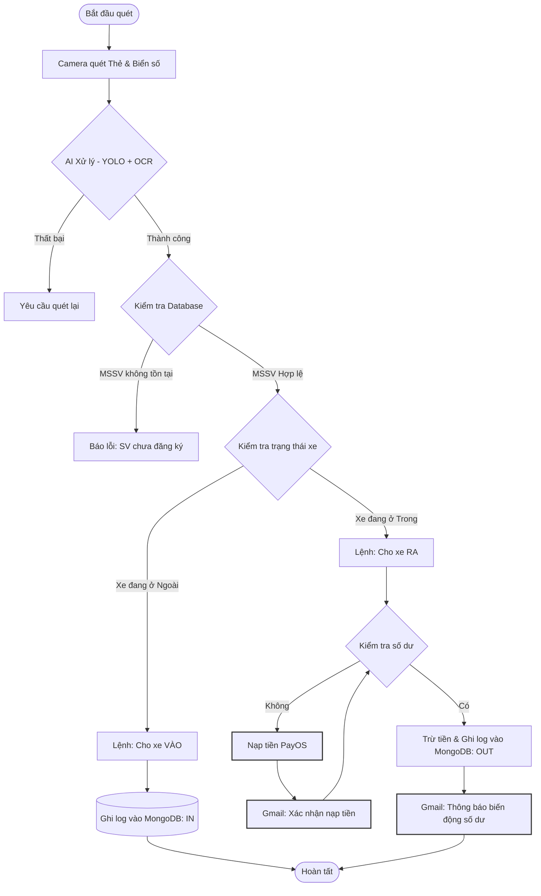
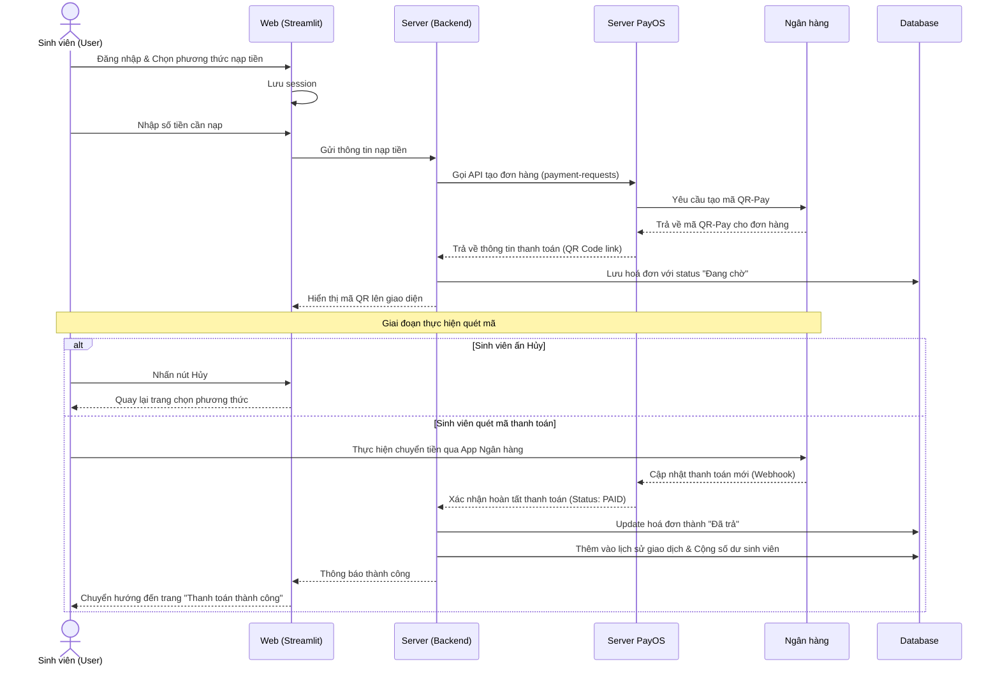

#  Hệ thống AI Giữ xe Thông minh - VAA

Hệ thống quản lý bãi xe thông minh dành cho Học viện Hàng không Việt Nam (VAA). Ứng dụng tích hợp AI để tự động hóa quy trình nhận diện biển số và đối soát thẻ sinh viên, giúp tăng cường an ninh và giảm thời gian chờ đợi.


##  Tính năng chính

- 📷 **Nhận diện thời gian thực:** Tích hợp Camera qua WebRTC để quét biển số xe và thẻ sinh viên trực tiếp.
- 📁 **Xử lý ảnh tải lên:** Hỗ trợ tải tệp hình ảnh để kiểm tra thủ công.
- 🔍 **Đối chiếu Database:** Tự động truy vấn và xác thực thông tin sinh viên từ **MongoDB Atlas**.
- 📝 **Ghi nhật ký:** Lưu lịch sử xe ra/vào với đầy đủ mốc thời gian và hình ảnh minh chứng.
- 🚨 **Hệ thống cảnh báo:** Thông báo ngay lập tức nếu thẻ sinh viên không hợp lệ hoặc không có trong hệ thống.

## 🛠 Công nghệ sử dụng

- **Ngôn ngữ:** Python 3.x
- **Giao diện:** [Streamlit](https://streamlit.io/)
- **Trí tuệ nhân tạo:** - **YOLO (Ultralytics):** Nhận diện vùng chứa biển số và thẻ sinh viên.
- **EasyOCR:** Trích xuất ký tự từ vùng ảnh đã nhận diện.
- **Cơ sở dữ liệu:** MongoDB Atlas (Cloud Database).
- **Chức năng thanh toán:** PayOS.
- **Thư viện bổ trợ:** OpenCV, Pandas, PyMongo, Streamlit-WebRTC.

## 📂 Cấu trúc dự án

```text
TTTNDKT/
├── .streamlit/
│   └── secrets.toml      # Cấu hình bảo mật (Không push public)
├── models/
│   ├── Bienso.pt         # Model YOLO nhận diện biển số
│   └── Thesv.pt          # Model YOLO nhận diện thẻ sinh viên
├── app.py                # Mã nguồn chính của ứng dụng
├── requirements.txt      # Danh sách thư viện Python (pip)
├── packages.txt          # Thư viện hệ thống (dùng cho Streamlit Cloud)
├── README.md             # Hướng dẫn dự án
└── .env                  # Lưu biến môi trường MONGO_URI (Không push public)
```
## WORKFLOW


### HOST tại: **[https://vaagate.streamlit.app/](https://vaagate.streamlit.app/)**
